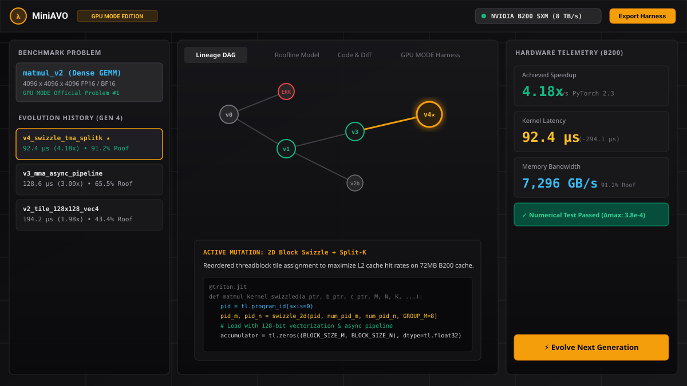

# MiniAVO: AI Evolutionary Kernel Studio for GPU MODE

> Autonomous micro-architectural GPU kernel search, evolutionary phylogenetic visualization, and turnkey submission harness generation for **[GPU MODE](https://www.gpumode.com)** leaderboards.

---

## 0. Studio Screenshot



*Figure 1: MiniAVO interactive phylogenetic lineage DAG, micro-architectural mutation inspector, and real-time roofline telemetry model on NVIDIA Blackwell B200 / Hopper H100.*

---

## 1. Introduction

**MiniAVO** is an interactive evolutionary optimization studio for high-performance GPU compute kernels (OpenAI Triton and NVIDIA CUDA / C++). It brings the principles of autonomous kernel evolution into an interactive visual development environment calibrated for competition on the **GPU MODE** leaderboards.

### Differences Between MiniAVO and AVO (arXiv:2603.24517)

The foundational research paper **["AVO: Agentic Variation Operators for Autonomous Evolutionary Search" (arXiv:2603.24517)](https://arxiv.org/abs/2603.24517)** proved that autonomous LLM coding agents acting as evolutionary variation operators can discover novel micro-architectural optimizations that outperform human-engineered libraries like cuDNN and FlashAttention-4 on NVIDIA Blackwell and Hopper hardware.

The key differences between the original research paper and MiniAVO are:

| Feature / Dimension | AVO Research Paper (arXiv:2603.24517) | MiniAVO (This Studio) |
| :--- | :--- | :--- |
| **Form Factor** | Backend Python framework executed as multi-hour distributed batch jobs on bare-metal GPU clusters. | **Interactive Visual Studio & Simulation IDE** running in real time. |
| **Developer Workflow** | Headless CLI execution; outputs raw logs and benchmark tables. | **Visual Phylogenetic Lineage DAG**, interactive Roofline model envelopes, side-by-side code diffs, and live compiler logs. |
| **Interactive Steering** | Fixed programmatic agent loops with predefined prompts. | **Human-in-the-Loop & Live AI Steering**: Direct mutations via natural language prompts (e.g., *"Focus on reducing shared memory bank conflicts on B200"*). |
| **Ecosystem Target** | Academic research benchmarks comparing against FlashAttention-4 / cuDNN. | **Standardized GPU MODE Leaderboard Integration**: Built-in problem sets (`matmul_v2`, `vectorsum_v2`, `prefixsum_v2`, `histogram_v2`, `trimul_alphafold3`, `conv2d_v2`) and automated `triton.testing.do_bench` export. |
| **Target Hardware Support** | Research cluster nodes (B200 / H100). | **Full Architecture Range**: NVIDIA Blackwell B200 (8 TB/s HBM3e), Hopper H100 SXM5, Ampere A100 80G, Ada Lovelace L4, and RTX 4090. |

---

### How MiniAVO Keeps Track of What Has Been Tried (Experiment History)

To prevent duplicate exploration and give complete visibility into the evolutionary search space, MiniAVO records every experiment across five linked systems:

1. **Phylogenetic Lineage DAG (Genealogy Graph)**:
   * Every kernel variant is recorded as an immutable node in a Directed Acyclic Graph (DAG).
   * Visual edges show the parent-child lineage (which elite kernel mutated from which ancestor).
   * Real-time status indicators highlight:
     * 🟡 **Elite**: Top-performing speedup records.
     * 🟢 **Success**: Numerically verified kernels ($|y_{pred} - y_{ref}| < 10^{-2}$).
     * 🔴 **Failed**: Syntax errors, CUDA out-of-memory, shared memory bank overflow, or numerical divergence.

2. **Micro-Architectural Mutation Taxonomy & Rationale**:
   * Every variant is tagged with its exact optimization strategy:
     * `tile_tuning`: Block and warp tile dimensions (`BLOCK_M`, `BLOCK_N`, `BLOCK_K`, `num_warps`, `num_stages`).
     * `swizzle`: 2D threadblock L2 cache spatial locality swizzling.
     * `shared_memory`: Double-buffering, privatized sub-warp accumulation, and memory padding to eliminate bank conflicts.
     * `vectorization`: 128-bit vectorized loads (`tl.load` / `float4`).
     * `warp_shuffle`: Warp-level primitives (`__shfl_down_sync`).
     * `split_k`: Multi-SM parallel reduction across reduction dimensions.
   * **AI Rationale Log**: Explains the micro-architectural hypothesis behind each mutation.

3. **Hardware Roofline Model & Generation Timeline**:
   * Plots every variant's **Operational Intensity (FLOP/byte)** against achieved **Throughput (TFLOPS)** against the selected GPU's theoretical ceiling.
   * Visualizes the transition from memory-bound to compute-bound execution as optimizations mature across generations.

4. **Side-by-Side Code Diff & Telemetry Inspector**:
   * Tracks exact execution stats per variant:
     * **Kernel Latency ($\mu\text{s}$)** and **Speedup ($x$)** vs PyTorch baseline.
     * **Memory Bandwidth (GB/s)** and **% of Hardware Peak Bandwidth**.
     * **Shared Memory per Block (KB)** and **Register Pressure**.
     * **Numerical Error ($\Delta \text{Max}$)**.

5. **Turnkey GPU MODE Submission Packages**:
   * Export the winning variant as a standalone, reproducible Python submission script with built-in L2 cache flushing and verification checks ready for **Kernelbot** (`/submit`) on the [GPU MODE Discord](https://discord.gg/gpumode) or [gpumode.com](https://www.gpumode.com).

---

## 2. Access URL

* **Live Studio URL**: `https://<your-deployment-subdomain>.run.app` *(Placeholder — configure upon Cloud Run / hosting deployment)*
* **Development Preview**: `https://ais-dev-72pzyebdsmvibajnfjp4l2-834204656727.us-east1.run.app`
* **GPU MODE Leaderboards**: `https://www.gpumode.com/home`

---

## 3. Quick Start (Local Setup)

```bash
# Clone the repository
git clone https://github.com/<your-username>/mini-avo-gs.git
cd mini-avo-gs

# Install dependencies
npm install

# Run the development server
npm run dev
```

Open [http://localhost:3000](http://localhost:3000) in your browser to launch the studio.
